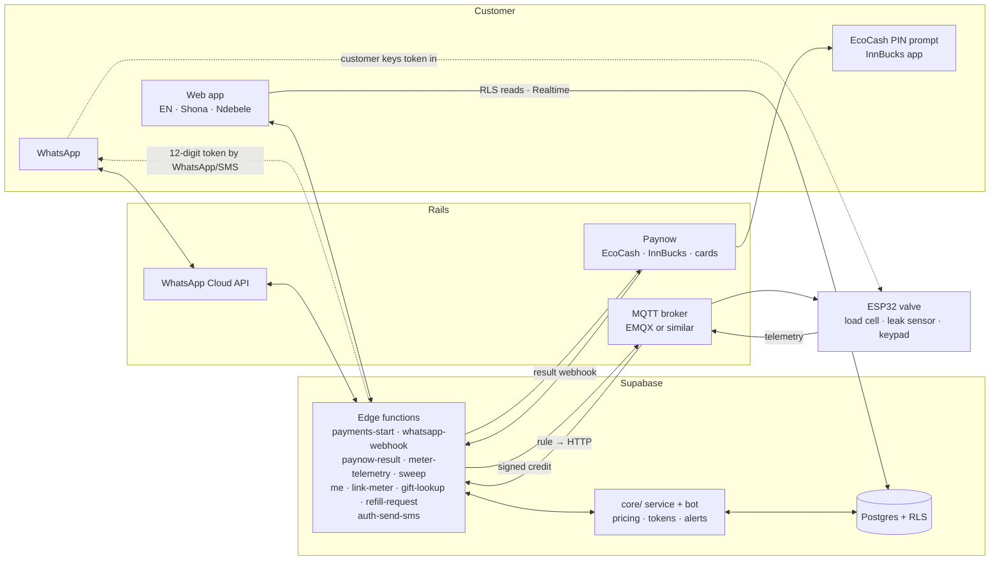

# Gasguys integration map

What has to connect to what for a customer in Mbare to pay $1 on EcoCash and have their gas come on, what each piece is in the prototype today, and what you need to get before it can be real. Sources and detail are in [research/](research/); the prototype code is referenced by path.

## The one correction that changes the plan

**Bboxx's smart cooking valve does not measure gas.** It is a time lock: the customer gets a full 12 kg cylinder on a 30-day contract with daily payments, and the valve opens while they are paid up and closes when they fall behind ([research/hardware-and-payg-lpg.md](research/hardware-and-payg-lpg.md) §0, citing Bboxx's own statement to the Clean Cooking Alliance). Bboxx publishes nothing about what is inside it (no ESP32 confirmed) and has no public API. In January 2026 Bboxx spun its Pulse back office out as **Asopo Technologies**, which now licenses it to other companies.

The "buy $1, get that much gas" model you described is what **PayGo Energy (now Sun King)** and **Circle Gas / M-Gas** run in Kenya and Tanzania: a meter that counts grams and shuts off when the paid-for grams are used. That model is fairer for irregular incomes and it is what the prototype implements. It also leaves room for Bboxx valves: the meter sits behind one interface (`MeterGateway` in [core/providers.ts](../core/providers.ts)), so a Pulse adapter that turns credit into days of access can be added without touching the app, bot or payments.

**Recommended path:** bench-build the ESP32 gram meter in [firmware/](../firmware/) now, and in parallel ask Bboxx/Asopo for valve pricing and Pulse API access. Decide on hardware once you have both numbers.

## The system

**A purchase, end to end:** customer picks an amount on WhatsApp or the web → `startPurchase` saves a pending payment and asks Paynow to push an EcoCash PIN prompt → customer enters their PIN → Paynow calls `paynow-result` → we re-poll Paynow to confirm, then `settlePayment` → the backend issues the next token counter, signs a credit command and publishes it to the valve → the valve checks the signature, adds the grams and opens → WhatsApp confirms with the receipt. If the valve is offline, the same payment's 12-digit token goes to the customer, who keys it in. Both paths share one counter, so credit can never be applied twice.

## Integration by integration

| # | Integration | What it does | In the prototype | What you need to go live |
|---|---|---|---|---|
| 1 | **Smart valve (ESP32)** | Holds credit in grams, opens/closes the valve, measures gas with a load cell, detects leaks and tampering, accepts offline tokens | Simulated in the browser ([core/device.ts](../core/device.ts)); firmware written in [firmware/src/main.cpp](../firmware/src/main.cpp), not yet flashed | Bench parts (ESP32, motorised ball valve rated for LPG, HX711 + load cell, MQ-6, 3×4 keypad, SIM7070G). Field units need ATEX-rated valve hardware and SAZ/ZERA approval |
| 2 | **Connectivity** | Gets commands to the valve and telemetry back | Simulated (toggle "Lose network" in the meter view) | IoT SIMs. No Zimbabwean operator lists NB-IoT or LTE-M yet and Econet switches off 3G in Dec 2027, so use a SIM7070G (NB-IoT/LTE-M with 2G fallback), not a SIM7080G |
| 3 | **MQTT broker** | Always-on connection to every valve; per-device TLS certificates | Simulated | A hosted broker with an HTTP publish API and a rule engine (EMQX Cloud or HiveMQ). Adapter: [supabase/functions/_shared/mqtt.ts](../supabase/functions/_shared/mqtt.ts) |
| 4 | **Credit and token engine** | Converts money to grams, issues and signs credit, issues 12-digit offline tokens, prevents double-spend | **Real code.** [core/token.ts](../core/token.ts), with the same maths in [firmware/src/token.cpp](../firmware/src/token.cpp); both pass the same test vectors | Nothing to buy. Consider switching to the open [OpenPAYGO Token](https://github.com/EnAccess/OpenPAYGO-python) standard if you ever use third-party meters |
| 5 | **Backend** | Customers, meters, payments, refills, alerts; the rules in [core/service.ts](../core/service.ts) | The sandbox runs it in the browser against an in-memory store. The customer web app also has a live mode on Supabase ([src/backend/supabase.ts](../src/backend/supabase.ts)): phone OTP sign-in, RLS reads, Realtime, and edge functions for every write; switched on by `VITE_SUPABASE_URL` + `VITE_SUPABASE_ANON_KEY` | A Supabase project: run the three migrations, deploy the functions, set secrets, set the two `VITE_` variables for the web app |
| 6 | **EcoCash** | Main payment rail: server-triggered PIN prompt on the customer's phone | Simulated: the WhatsApp phone shows the EcoCash prompt; any 4-digit PIN approves | **Start with Paynow** (below). Add EcoCash direct later (developers.ecocash.co.zw has a sandbox) to cut the 2.5% fee on your biggest channel |
| 7 | **InnBucks** | Second wallet, strong with cash-first customers who top up at Simbisa outlets | Simulated: a 6-digit code the customer approves in the InnBucks app | Via Paynow (reported to work only on a live account, not in test mode) or InnBucks' own merchant API (code valid 10 min, poll no more than every 30 s, no webhook) |
| 8 | **Paynow** | One integration for EcoCash, InnBucks and Visa/Mastercard; fees 2.5% mobile, 3.5% + 50c card | Adapter written: [supabase/functions/_shared/paynow.ts](../supabase/functions/_shared/paynow.ts) (Express Checkout, web checkout, hash check, polling) | A Paynow merchant account with **two integrations, USD and ZiG**. Test one reported issue early: IP allow-listing that could block Supabase's callback |
| 9 | **WhatsApp Business** | The main front door: buy, gift, balance, refill, alerts | **Real bot code** ([core/bot.ts](../core/bot.ts)) running in the simulator; Cloud API adapter and webhook written | Meta Business verification, a dedicated number, WhatsApp Cloud API app, and the utility templates in [whatsapp-templates.md](whatsapp-templates.md). WhatsApp Pay does not exist in Zimbabwe, so payment is the server-side EcoCash push, as built |
| 10 | **Diaspora cards** | Relatives abroad gift gas to a family meter | Simulated card checkout page | Paynow card checkout. Stripe does not onboard Zimbabwean merchants. Later: a biller listing inside Mukuru or WorldRemit |
| 11 | **Sign-in codes (and SMS)** | Sign-in codes; backup for leak alerts | Code is always 123456 in the sandbox. Live: Supabase Auth's Send SMS hook ([auth-send-sms](../supabase/functions/auth-send-sms/index.ts)) delivers the code on WhatsApp with an Authentication template instead of SMS | The `gasguys_login_code` Authentication template approved, and the hook enabled with `SEND_SMS_HOOK_SECRET`. An SMS provider with good delivery to Econet, NetOne and Telecel is still wanted for leak-alert backup and for customers without WhatsApp |
| 12 | **Refill logistics** | Low-cylinder signal books a swap; ops dispatches | Working in the sandbox: auto-booked at 15%, moved along in the Ops console | Your distribution partner (the pitch deck's Zuva micro-hubs). QR tags on cylinders (99% return rate at PayGo) |

## How Gasguys improves on Bboxx pay-as-you-cook

1. **Pay for gas, not days.** Credit is grams, so a customer who cooks less pays less, and $1 buys a known amount.
2. **Works without network.** Every purchase also produces a 12-digit token the valve checks locally, the way people already buy ZESA tokens. Bboxx's valve depends on the network to unlock.
3. **Instant, 24/7 top-up** on WhatsApp. Slow top-ups and offices shut on evenings and weekends were the top complaints in Bboxx's own Rwanda pilot.
4. **Gift gas from abroad.** Pay by card for Gogo's meter in Lupane; she gets a WhatsApp in isiNdebele.
5. **USD or ZiG,** priced from one tariff table, with credit held in grams so exchange-rate moves don't eat what people already bought.
6. **Refills book themselves** when the load cell sees 15% left.
7. **Safety built in:** leak sensor shuts the valve, locks it until a technician clears it, and alerts the customer on WhatsApp.
8. **Credit can't be forged** even if the broker is compromised: every online credit is signed with the valve's own key.

## Before launch (not code)

- **ZERA licence** for LPG retail (SI 57 of 2014), EMA hazardous-substance certificate, fire clearance. Ask ZERA whether the valve needs installer certification and weights-and-measures approval.
- **POTRAZ data controller licence** (Cyber and Data Protection Act; needed once you hold data on 50+ people; inspections started 1 Sep 2026), plus a certified data protection officer.
- **Sell gas units, not stored money.** Keep credit as grams, non-transferable and not redeemable for cash, so it is less likely to be treated as e-money by the RBZ. Get a lawyer to confirm.
- **Don't build the business case on carbon credits.** KOKO Networks went into administration in February 2026 when Kenya didn't authorise its credits. The pitch deck lists carbon credits as a revenue stream; treat it as upside.
- **Native-speaker review** of the Shona and Ndebele copy. The drafts and the words to check first are in [ux-spec.md](ux-spec.md) §5 and [i18n-notes.md](i18n-notes.md).
